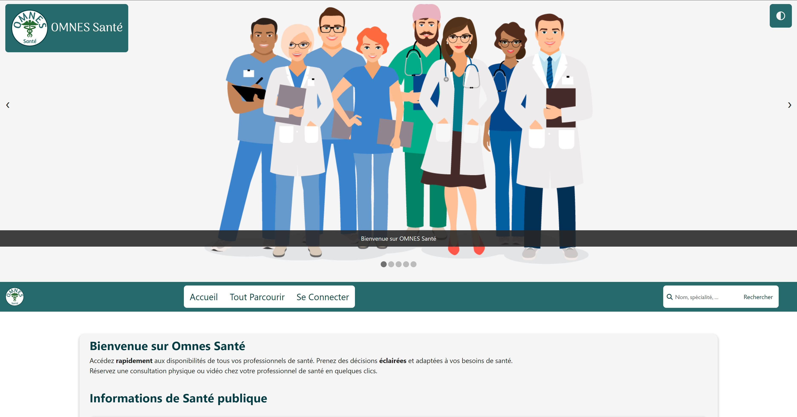

# Omnes Santé

Projet du deuxième semestre de troisième année à l'ECE en développement web.

Plateforme pour prendre un rendez-vous médical en ligne, réalisée en HTML/CSS/JS, PHP, MySQL et Bootstrap.

Rendu le 29/05/2022.

> **Note:** La base de données de ce projet n'est plus disponible en ligne. Certaines fonctionnalités ne sont donc plus accessibles.

## A propos

On souhaite de créer un site web pour prendre un rendez-vous médical en ligne. On va l’appeler « Omnes Santé**. Ce site permet au client de voir une liste de tous le personnel de Omnes Santé, de sélectionner un spécialiste préféré, de voir ses informations pertinentes, tels que son CV, ses coordonnées, et son calendrier de la semaine ainsi que sa disponibilité pour recevoir un rendez-vous. Le client peut ensuite prendre un rendez-vous avec le spécialiste de son choix. Le site permet aussi au client de voir les rendez-vous qu’il a pris et de les annuler.

## Cahier des charges

### Extraits du cahier des charges

Créer un site web en vous servant des technologies vues en classe pour prendre un rendez-vous médical en ligne. Le site permet au client de voir une liste de tous le personnel de Omnes Santé, de sélectionner un spécialiste préféré, de voir ses informations pertinentes, tels que son CV, ses coordonnées, et son calendrier de la semaine ainsi que sa disponibilité pour recevoir un rendez-vous. Le client peut ensuite prendre un rendez-vous avec le spécialiste de son choix. Le site permet aussi au client de voir les rendez-vous qu’il a pris et de les annuler.

Le site doit inclure les pages suivantes :

- **Accueil** : page d’accueil du site, avec un menu de navigation, un logo, un carrousel d’images, des informations générales et un pied de page.
- **Tout Parcourir** : Il s’agit de tous les catégories des services disponibles chez Omnes Santé. Il y a trois catégories de ce service : (i) **Médecine générale**, (ii) **Médecins spécialistes**, et (iii) **Laboratoire de biologie médicale**.
- **Médecine générale** : Il s’agit de tous les médecins généralistes disponibles chez Omnes Santé.
- **Médecins spécialistes** : Il s’agit de tous les médecins spécialistes disponibles chez Omnes Santé. Il y a 8 catégories de médecins spécialistes : **Addictologie**, **Andrologie**, **Cardiologie**, **Dermatologie**, **Gastro-Hépato-Entérologie**, **Gynécologie**, **I.S.T.** et **Ostéopathie**
- **Laboratoire de biologie médicale** : On va y trouver des services disponibles (par exemple, prise et examen du sang, de l’urine, dépistage covid, etc.), et les règles avant, durant et après sur cet examen/dépistage.
- **Recherche** : Il s’agit d’une page de recherche pour trouver un médecin spécialiste ou un médecin généraliste par son nom ou par son domaine de spécialité.
- **Votre compte** : Il s’agit d’une page pour gérer le compte du client. Le client peut voir ses informations personnelles, ses rendez-vous, et ses informations de paiement. Les médecins peuvent aussi voir leurs informations personnelles et leurs rendez-vous. Les administrateurs peuvent voir tous les informations des clients et des médecins.
- **Paiement** : Il s’agit d’une page factice pour payer le rendez-vous. Le client reçoit un email de confirmation après avoir payé le rendez-vous.
- **Système de Chat** : Il s’agit d’un système de chat pour que le client puisse discuter avec le médecin avant le rendez-vous.

Les technologies autorisées sont : HTML, XML, CSS, JavaScript, jQuery, Bootstrap, PHP, et MySql.

Vous êtes libres de proposer des fonctionnalités supplémentaires.

### Travail réalisé

Nous avons réalisé toutes les pages demandées dans le cahier des charges en utilisant les technologies HTML, CSS, JS, PHP, MySQL et Bootstrap. Nous avons aussi ajouté des fonctionnalités supplémentaires :

- **Thème sombre** : Le client peut choisir entre le thème sombre et le thème clair.
- **Widget d'informations sur le Covid** : Le client peut voir les dernières statistiques sur le Covid-19 en France et dans le monde.
- **Widget de news santé** : Les derniers Tweets du ministère de la Santé sont affichés sur la page d'accueil.
- **Widget Google Maps** : Le client peut voir l'emplacement de Omnes Santé sur une carte Google Maps dans le footer des pages.
- **Plateforme de paiement** : Le client peut payer son rendez-vous en ligne pour de vrai avec Paypal.
- **Système de chat** : Le système de chat entre clients et médecins est fonctionnel.

## Ce que nous avons appris

Nous avons chacun pu apprendre à utiliser les technologies HTML, CSS, JS, PHP, MySQL et Bootstrap. Nous avons pu mettre en place une organisation pour un projet de courte durée mettant l'accent sur la communication et tout particulièrement sur les points forts de chacun.

## Installation

Pour lancez le projet, vous devez installer un serveur web (Apache) et un serveur de base de données (MySQL). Vous pouvez utiliser WampServer pour Windows ou Mamp pour Mac. Il vous suffit ensuite de cloner le projet dans le dossier www de WampServer ou Mamp, puis de naviguer vers le dossier du projet dans votre navigateur web.

## Contributeurs

- Adrien Blair [@Ahddry](https://github.com/Ahddry)
- Donatien Chevillard [@donatien-chevillard](https://github.com/donatien-chevillard)
- Arthur Fournier [@space192](https://github.com/space192)
- Pierre-Louis Paillet [@pierrelouispaillet](https://github.com/pierrelouispaillet)

## Copyright

> Pour les étudiants, citez-nous si vous souhaitez réutiliser ce projet dans le cadre de vos propres travaux, ca vous évitera de vous faire prendre pour plagiat.

## Captures d'écran

